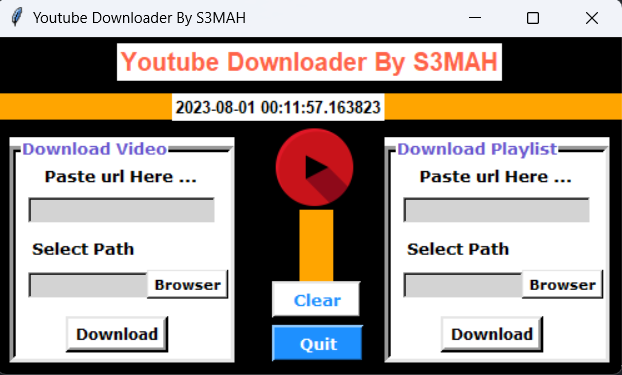

# YouTube Video Downloader 🎥

A simple Python script to download YouTube videos easily. 🚀



## Description 📝

This script allows you to download YouTube videos in different formats and qualities. It uses the `pytube` library, making it easy to use and reliable. 💡

## Requirements 🛠️

- Python 3.x
- `pytube` library (install using `pip install pytube`)

## How to Use 🚀

1. Clone this repository or download the `yt-downloader.py` file.

2. Install the required `pytube` library using the following command: ```pip install pytube```

3. Run the script in your terminal or command prompt: ```python yt-downloader.py```

## Note 📝
Please make sure to comply with YouTube's terms of service and the copyrights of the videos you download.
